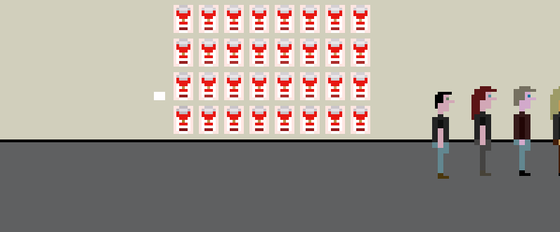

# The Artist Is Present

## [Play Online](https://www.pippinbarr.com/the-artist-is-present/) (HTML5, desktop only)

## Description
*Are games art?! This one definitely is! The Artist is Present is a Sierra-style recreation of the famed performance piece of the same name by artist Marina Abramovic at the Museum of Modern Art in New York City. Have the experience only a lucky few have ever had! Stare into Marina Abramovic’s eyes! Make of it what you will! Just like art!*

Released on 14 September 2011, *The Artist Is Present* was **originally** written in ActionScript 3 using FlashBuilder 4.5 and the excellent [Flixel](http://www.flixel.org/) library.

This version is being ported to the also excellent [Phaser 3](https://phaser.io/) library for JavaScript. The font in *The Artist Is Present* is [Commodore 64 Pixelized](http://www.dafont.com/commodore-64-pixelized.font) by [Devin Cook](http://www.devincook.com/).

~~You can read [some writing about the game](https://www.pippinbarr.com/search.html?q="The Artist Is Present") on my website.~~ The Artist Is Present was featured on [IndieGames.com](http://indiegames.com/2011/09/browser_game_pick_the_artist_i.html), written up by [Kotaku](http://kotaku.com/5841304/new-video-game-delivers-the-immersive-realism-of-waiting-5-hours-in-line-at-a-museum), [Joystiq](http://www.joystiq.com/2011/09/18/the-artist-is-present-is-a-game-about-waiting-in-line-at-a-museu), [The Huffington Post](http://www.huffingtonpost.com/2011/09/15/marina-abramovic-the-artist-is-present-video-game_n_964968.html), [Spiegel Online](http://www.spiegel.de/netzwelt/games/0,1518,787276,00.html) and many more. I was interviewed about the game by [Slate](http://www.slate.com/blogs/browbeat/2011/09/16/marina_abramovi_s_the_artist_is_present_as_a_video_game_intervie.html), [The Village Voice](http://blogs.villagevoice.com/runninscared/2011/09/pippin_barr_man.php), [ARTINFO](http://www.artinfo.com/news/story/38632/marina-abramovics-the-artist-is-present-performance-becomes-an-infuriating-video-game/), and [Hyperallergic](http://hyperallergic.com/35808/pippin-barr-interview/) among others. The game was even tweeted by [The Museum of Modern Art](http://twitter.com/#!/MuseumModernArt) itself.

The Artist Is Present has appeared in the exhibitions [The Name of the Game](http://www.stephenlawrencegallery.net/CB-TheNameOfTheGame-Intro.html) at the [Stephen Lawrence Gallery](http://www.stephenlawrencegallery.net/), It's Art in the Game at [Museum Hilversum](http://www.museumhilversum.nl/), [Space Invaders](http://www.nikolajkunsthal.dk/en/udstillinger/space-invaders) at [Nikolaj Kunsthal](http://www.nikolajkunsthal.dk/en/), [Up Up Down Down Left Right Left Right B A Start](http://www.spacesgallery.org/project/up-up-down-down-left-right-left-right-b-a-start) at [SPACES](http://www.spacesgallery.org/), [Pause: Computer Games and Cultural Contingencies](http://www.khm.de/nocache/aktuelles/veranstaltungen/veranstaltung/article/3037-pause-computer-games-and-cultural-contingencies/nCall/3/) at [Temporary Gallery](http://www.temporarygallery.org/), Brot und Spiele at the [Keine Humboldt Gallerie](http://www.kleinehumboldtgalerie.de/about/geschichte/), [The Aesthetics of Gameplay](http://gameartshow.siggraph.org/gas/) by the [SIGGRAPH Digital Arts Community](http://siggrapharts.ning.com/) (online), and the [Montréal Digital Arts Biennial](http://bianmontreal.ca/en/calendar/physicalite) at the [Musée d'Art Contemporain de Montréal](http://www.macm.org/en/).

## Documentation
* Read the [Press kit](../press) for press information
* Read the [Process documentation](../process) for process journal, to do list, and related work
* Read the [Commit History](https://github.com/pippinbarr/the-artist-is-present/commits/master) for step-by-step information about how the project was built
* Look at the [Code Repository](https://github.com/pippinbarr/the-artist-is-present) for source code etc., including the original Flash Builder code
* Download the [original .swf file of The Artist Is Present](https://github.com/pippinbarr/the-artist-is-present/releases/tag/swf) if you want to

## License
_The Artist Is Present_ is an open source game licensed under a [Creative Commons Attribution-NonCommercial 3.0 Unported License](http://creativecommons.org/licenses/by-nc/3.0/). You can obtain the source code from its [code repository](https://github.com/pippinbarr/the-artist-is-present) on GitHub.
