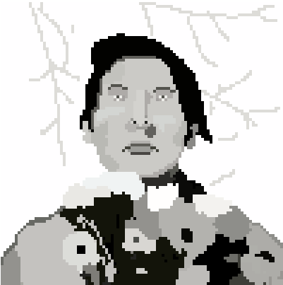
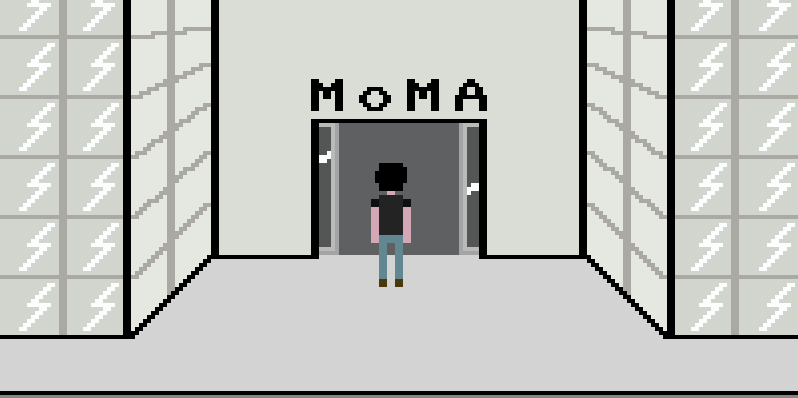
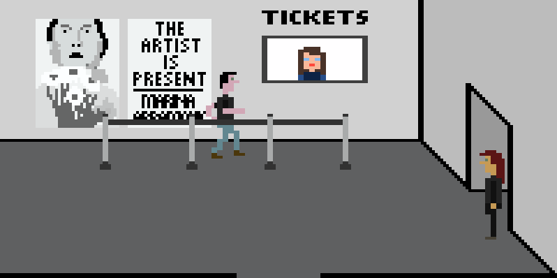
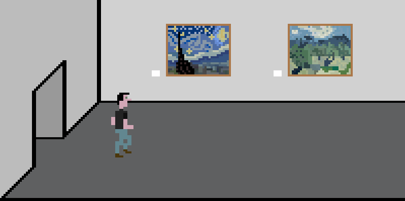
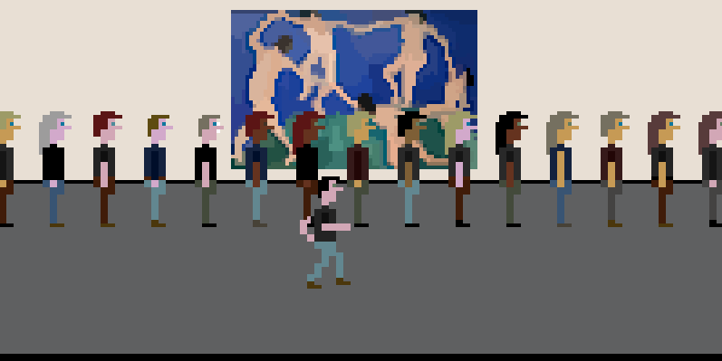
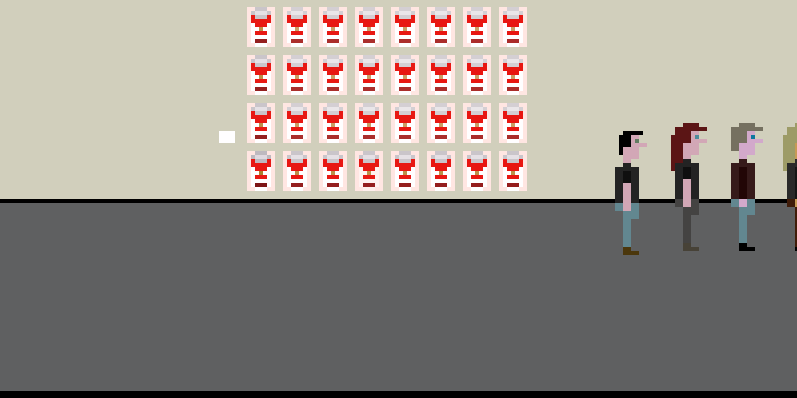
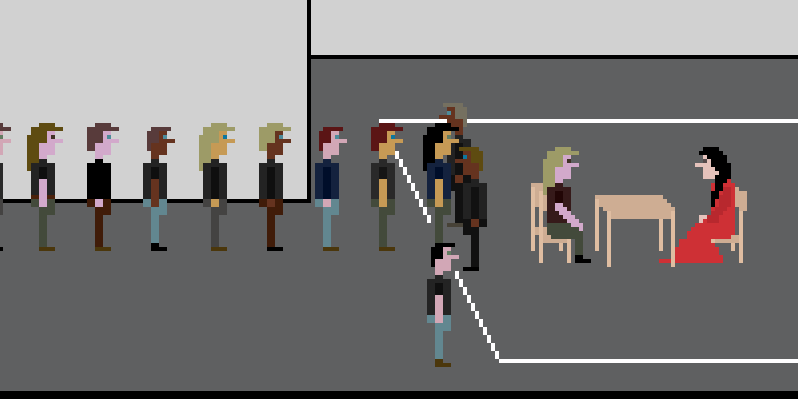

# _The Artist Is Present_ Press Kit

*Are games art?! This one definitely is! The Artist is Present is a Sierra-style recreation of the famed performance piece of the same name by artist Marina Abramovic at the Museum of Modern Art in New York City. Have the experience only a lucky few have ever had! Stare into Marina Abramovic’s eyes! Make of it what you will! Just like art!*

#### [Play _The Artist Is Present_](https://www.pippinbarr.com/the-artist-is-present/)

## The basics

* Developer: [Pippin Barr](http://www.pippinbarr.com/)
* Original release: 14 September 2011
* HTML5 re-release: 13 July 2022
* Platform: Browser (desktop and mobile)
* Code repository: https://github.com/pippinbarr/the-artist-is-present
* Price: $0.00

## Who is this Pippin Barr guy?

Pippin is an experimental game developer who has made games about everything from [Eurovision](http://www.pippinbarr.com/2012/03/27/epic-sax-game/) to [performance art](http://www.pippinbarr.com/2011/09/14/the-artist-is-present/) to [dystopian post-work futures](http://www.pippinbarr.com/games/2017/07/03/it-is-as-if-you-were-doing-work.html). He's an Associate Professor in the [Department of Design and Computation Arts](http://www.concordia.ca/finearts/design.html) at [Concordia University](http://www.concordia.ca/) in Montréal. He is also the associate director of the [Technoculture, Art, and Games (TAG)](http://tag.hexagram.ca/) Research Centre, which is part of the [Milieux Institute for Arts, Culture, and Technology](http://milieux.concordia.ca/).

## Description

_The Artist Is Present_ is almost too big to describe adequately at this point. At heart it's a videogame recreation of Marina Abramović's famous performance of the same name in the style of early Sierra adventure games. You take on the role of an audience member arriving at the museum to check out the performance and, if you're willing, you can buy a ticket and join the queue to sit with Marina Abramović herself. Good luck with that!

## History

The game came about through some bravado on my part in an experimental game design course I was teaching at the IT University of Copenhagen. I'd been talking about experimental artists as points of inspiration and one of my focal points was Marina Abramović's work. During class I claimed you could even make a game out of this performance of sitting in a chair and looking into people's eyes. Hilarity and a lot of work ensued and I released the original version on 14 September 2011.

Because this was one of the very early videogames to interpret the art world in this way, it got a fair bit of media attention (see the [information page](../info)) and people were generally interested in it. It remains the game I seem to be most well-known for, almost to a painful extent. But I'll take it!

In fact, Marina Abramović herself got in touch and we ended up collaborating on some projects together (loosely speaking), including [*The Digital Marina Abramović Institute*](https://www.pippinbarr.com/the-digital-marina-abramovic-institute/info), [*Abramović Method Games*](https://www.pippinbarr.com/abramovic-method-games/info), and [*Durations*](https://www.pippinbarr.com/durations/info). That was a hell of a time.

Everything was going great, then Flash was discontinued and the game lay dormant as I hoped and waited for some emulator solution that would mean I didn't have to do much work to resurrect it. I was still able to exhibit it via the rapidly dying stand alone Flash player Adobe was still making available. But these days barely even that.

I made a sequel to the game called [*The Artist Is Present 2*](https://www.pippinbarr.com/the-artist-is-present-2/info) which is much the same except that you play as Marina Abramović. That one was written in JavaScript with Phaser, so it actually worked in modern browsers.

Eventually, I wrote a book called [The Stuff Games Are Made Of](https://www.pippinbarr.com/books/the-stuff-games-are-made-of) and included a chapter about *The Artist Is Present*. This made me feel that I would absolutely have to bring the game back to life. So, starting with the bones of *The Artist Is Present 2*, I did exactly that. It was remarkably hard for a game that was "already done", but I got there in the end.

Enjoy?

## Technology

*The Artist Is Present* was originally written in ActionScript 3 using FlashBuilder 4.5 and the excellent [Flixel](http://www.flixel.org/) library.

The 2022 re-release has been (laboriously) ported to the also excellent [Phaser 3](https://phaser.io/) library for JavaScript. The font in *The Artist Is Present* is [Commodore 64 Pixelized](http://www.dafont.com/commodore-64-pixelized.font) by [Devin Cook](http://www.devincook.com/). It makes use of [Colbydude](https://github.com/Colbydude)'s [Phaser 3 Palette Swapping Example](https://github.com/Colbydude/phaser-3-palette-swapping-example) to do recoloring of the audience members so they look different from one another.

## License

_The Artist Is Present_ is an open source game licensed under a [Creative Commons Attribution-NonCommercial 3.0 Unported License](http://creativecommons.org/licenses/by-nc/3.0/). You can obtain the source code from its [code repository](https://github.com/pippinbarr/the-artist-is-present) on GitHub.

## Features

- Doors
- Tickets
- Queues
- Time
- Chairs

## Images

## Additional Links

- [Process documentation of _The Artist Is Present_](../process)
- [Commit history of _The Artist Is Present_](https://github.com/pippinbarr/the-artist-is-present/commits/master)

## Credits

- Pippin Barr: design, code, etc.
- Marina Abramović: the original performance

## Contact

* Email: [pippin.barr+press@gmail.com](mailto:pippin.barr+press@gmail.com)
* Website: [www.pippinbarr.com](http://www.pippinbarr.com/)
* Twitter: [@pippinbarr](https://www.twitter.com/pippinbarr)
* Instagram: [@pippinbarr](https://www.instagram.com/pippinbarr)
* Facebook: [Pippin Barr](http://www.facebook.com/pippin.barr)
