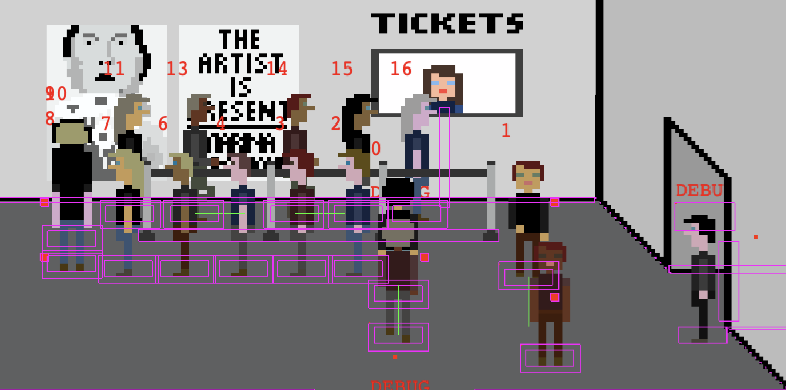

# Process journal

This process journal includes both my thoughts as I port the game from ActionScript to JavaScript as well as the original public-facing blog posts I wrote while making the original game.

# 2022

## Getting up and running (05-05-2022 15:25)

This feels a bit weird, but I'm attempting to apply MDM (Method for Design Materialization) even though all I'm doing is porting an old game from 2011 (okay let's face it, THE GAME from 2011) so that it works in modern browsers now that Flash is a goner. Still, it's not impossible there will be something worth saying, and besides it's good just to maintain the habit right?

The port so far has been remarkably smooth. I of course took the code and asset base of *The Artist is Present 2* as a starting point since it contains a huge amount of the necessary work (notably it reproduces all the key scenes from the original game). After cutting unneeded scenes (the apartment, the car) I had the kernel, but the key swap was to make the player a person other than Marina.

That turned out to be a little bit of a challenge that led down various paths of the entire game breaking over and over since it was designed to work with the Marina sprite, but I did get there in the end. Funniest bug was discovering that the player would automatically regenerate its appearance every time it walked into a new scene, meaning that their clothes, hair, skin color, etc. would constantly be shifting as they moved through the space. In itself quite a nice thought for a game (I wrote it down), but hard to track down and then hard to stick the landing on. But I did.

So we currently have a version in which you arrive outside and can navigate at least some way into the museum (I think it's broken because of the queue whispering stuff at the moment which won't be in the port).

It's nice to return to this world, and I feel at least somewhat optimistic about how well this has worked to this point. The queue behaviour is the obvious terrifying element I'm not yet ready to contemplate, but otherwise this is in a good position.

## Sad realization (2022-06-27)

As I slowly tried to rewrap my head around this project today I came to see that I'll more than likely need to restructure everything to be a single scene with a moving camera to handle the idea of a persistent queue. Otherwise I'm going to be reduced to stupidly weird logic around scene switching and what things are moving where at what time.

So... well it at least gives me a target.

## Progress is being made (2022-06-28)

After the other day's sad defeat by the frustrations of a multi-scene version I've managed to put together the single-world idea. So there's one World scene, and then a bunch of helper functions in separate sub-scene files that actually add the different screens so that the World.js file isn't overwhelming to look at.

In the process of getting the bits and pieces in place I ran into one fun physics bug that using Phaser3 introduced (and which I very much wonder if it's in place in TAIP2??) which is that any free-standing object ends up being pushable, so you get:

Which is great. Anyway, the newer version of Phaser introduces a `.setPushable(false)` which solves that particular issue.

At this point the really big-ass next things are

* Allow the player to sit on the chair and switch to the final animation (can do this without a queue)
* Create a starting queue (follow the original)
* Make that queue move up properly
* Make that queue with the player (let them enqueue)
* Make new people arrive convincingly into the queue

And would that be it? Well various little extra dialogs (the intro dialogs, the guard dialogs, the queue-join dialog, the ticket dialog)

## Queueing. Yes, it still sucks in 2022. (2022-06-29)

In the to do list I wrote about ticket queuing:

"But it may be doable comparatively simply I'm thinking...!?"

Well no.

I've been having a hard time with it frankly. The collision approaches and APIs for the old version and the new version feel too distant from one another to just slavishly reproduce the original code. As such I've been trying to make a "reasonable" version of queueing and moving through the world and it's hard. Currently I have a good set of waypoints that allow an individual visitor to move from outside into the museum to buy a ticket and from there ostensibly join the queue. The issue is around what happens when the bump into the player or each other and how they respond. I'm trying to make it so that whichever one *can* keep moving does so, but it's confusing as all get-out frankly. I might have something that's looking better now but they do these weird leg spasms where they briefly try to move only to collide again... ideally they wouldn't really try to move until the person they collided with has moved on, but how to detect and manage something like that??? You could check if their position has changed I suppose, but it's getting kludgy. SSIIISISISISIGHGIHGGHGHGHGH.

## Q! (2022-06-30)

A lot of work on queues today and they seeeem to work. We're getting down to the more flavour-y things. The majority of queue stuff is looking pretty strong and I think I have promising solutions to the rest.

Hilarious queue stuff and other stuff happened as you can see:

So, I'm not getting this done before the end of sabbatical, but I am getting it done next week for suresies.

## We "made it" (6 July 2022)

Well I've sent the game to Jim and Mary for a little light testing, but realistically I think it should be pretty robust by now. Since my last write up I obvious did... everything, though there was a weekend in there were I did... nothing.

At one point I was debugging hair:

Because there seemed to be people with multicolor hair showing up. I created this debug scene to just create a ton of people at a time so I could look at their hair, but eventually it turned out that it was just multiple overlaid people showing up in a scene and walking in synch. That old chestnut.

Anyhow, the game is essentially done and soon to be released. This is quite a big one since it's my most "famous" game and it feels good to have got it back out into the world again. Sweat smile.

## Somewhat done... right? (2022-07-13)

So Jim found a number of bugs which I fixed (all to do with queueing). Then I sent it back and he found a more subtle thing (difficulty of lining up well in queueing), which I fixed. And then I made it work on mobile. And now I think I should just ship it out and be done with it?

# 2011

## Simplicity kills (2011-08-24)

After allowing myself a bit of time off after _Safety Instructions_ I&#8217;m properly back at work on my next game. Without saying what it actually is, I&#8217;d like to just complain about how difficult I&#8217;ve been finding the process of coding.

Basically, an important component of the game is about being to stand in a queue. When I was planning the game initially, it seemed like this would be super easy and no problem at all. And yet, perhaps because I&#8217;m not the strongest coder, I&#8217;ve been really struggling to get the queuing interaction working well. While it&#8217;s (relatively) straightforward to get an &#8220;all A.I.&#8221; queue up and running, once you stick the avatar in there things getting considerably more complicated.

The problem is that once the avatar is in the picture, you end up with all these extra considerations. What if the avatar goes in the queue, then leaves it just as someone else is about to join in as well? What if the avatar runs straight to the front of the queue and tries to push in? What if the after stands in the way of people trying to join the queue but never actually joins it himself? Hypothetical hell.

Anyway, I _am_ making progress on this amazing interactive queue experience, but it&#8217;s funny how difficult it&#8217;s been. It&#8217;s also funny to listen to myself muttering about how it&#8217;s _worth it, damnit!_ because the game around the queuing does something interesting (to me). All this effort to produce something so intensely banal. Ain&#8217;t that just the way?

## On Queuing (2011-08-25)

As I&#8217;ve continued to do battle with the code for my &#8220;queuing simulation&#8221; I&#8217;ve found myself trying to convince myself that queues are somehow important things. Well, obviously they serve a key purpose in organising society (into nice orderly lines!), but perhaps even in video games they&#8217;re of some relevance? Because if so, then I would be working within a tradition, or something, and thus I would be less wasting my time, and more training like a diligent karate kid.

I suppose that one central relationship we have to queues in video games is&#8230; we don&#8217;t wait in them. Even where queues exist &#8211; most obviously in the traffic simulations of urban games &#8211; we tend to avoid them. It&#8217;s novel to play _GTA_ or _L.A. Noire_ for a while by obeying the traffic rules, but it&#8217;s very hard to maintain. There&#8217;s no real penalty for skipping the queues, so why would you? _Police Quest_, that favourite touchstone of mine, is one of the few games I can recall where you pretty much had to queue in traffic or die. Queue or die.

Even if we don&#8217;t queue ourselves, though, queues take shape in games. Again, this is mostly visible when we&#8217;re driving in a virtual city and watch as cars form a queue at the lights. Or, of course, if we stop our car in the middle of the street and create a queue behind us. And this queuing can be well or poorly executed. I was surprised at how minimalist the queue code was in _L. A. Noire_ for instance. If you stand in the street, the cars will just quietly wait in a long queue forever &#8211; there&#8217;s no sense of people becoming impatient and driving around (or over) you. Just epic, very computery waiting.

Queuing is, then, almost a form of Turing test. Only a computer would be content to wait indefinitely without taking action. Those placid cars in _L. A. Noire_ were far more jarring than the creepy-as-hell facial contortions of the characters, in terms of betraying the digital nature of the world. Queuing is both very human and, extended just a little too long, inhuman.

One aspect of the game I&#8217;m making is queuing. I like to think of it as &#8220;making queuing unfun again!&#8221;

## The White Cube (2011-08-26)

I&#8217;ve had occasion to think about gallery spaces and video games today, since the game I&#8217;m developing right now trades on precisely that. It occurred to me that gallery spaces are a brilliant space for video games to straightforwardly represent because, still, games can&#8217;t represent all that much.

The great thing about a gallery space is that, perhaps more than any other space I can think of, it&#8217;s a place where you&#8217;re not really allowed to do anything at all &#8211; and that nothingness of action is totally sanctioned both by social norms and enforced rules. No touching, no making loud noises, no interacting with the art work &#8211; obviously there are exceptions, artworks or galleries that explore contradictions to these rules, but still, by and large a gallery is a place where you don&#8217;t interact. Rather, you are (in theory) acted on by the art. You just stand there (or sit on the conveniently placed bench) and take it.

Just the sort of thing it&#8217;s easy to implement in a game &#8211; the less interaction, the easier it is. White cube, just add physics (if that &#8211; it&#8217;s not like you&#8217;re meant to touch the walls or jump in a gallery, after all). To that extent, then, it&#8217;s possible for me to implement a weirdly _authentic_ gallery space in the game I&#8217;m making &#8211; there&#8217;s not that much to it in terms of the place itself. I&#8217;ll be interested to see whether that fact about galleries lends a weird kind of authenticity to the game experience which games that seek to simulate more complex environments naturally can&#8217;t reach, even when they&#8217;re made by hundreds of people instead of just one.

With this blog&#8217;s powerful reach, I&#8217;m sure we&#8217;ll see a spate of big budget FPSes set in galleries real soon. You&#8217;re welcome.

## Bugs Glorious Bugs (2011-08-31)

One really fun thing about my current game project is that it&#8217;s a lot more &#8220;worldy&#8221; than the past few things I&#8217;ve done. That is, it works on the fundamental idea that there&#8217;s a world with space and people moving around in it. That&#8217;s just plain old ontologically awesome, of course. But it&#8217;s also great in connection with bugs.

Generally speaking, if you don&#8217;t have a world going on, your bugs can often be considerably less interesting. When there was a bug in _Safety Instructions_, for instance, it&#8217;s more along the lines of &#8220;the animation doesn&#8217;t play&#8221; or &#8220;the game doesn&#8217;t respond to the spacebar&#8221; or &#8220;the music glitches out.&#8221; To the extent that the game is more like a straight-up interface, the bugs are going to seem more like productivity annoyances.

But when you have a world, the bugs can much more easily enter into the fiction of the game and take their place in its ontology. A bug goes from being an obvious malfunction of code to being (wrongly) explainable in terms of the world of the game itself. Thus, when I see that the guy buying a ticket doesn&#8217;t walk away from the ticket counter, it&#8217;s part that his y-velocity isn&#8217;t being set, and partly that he&#8217;s arguing with the ticket seller and holding up the line. When there are huge gaps in the queue I find myself simultaneously searching for code-based reasons (targets are being set in the wrong order?) and world-based reasons (they&#8217;re saving a space for their friend?)

As the person in charge of the code and the existence of the world, there&#8217;s a sense in which I know that my fictional explanations for the behaviour are completely wrong. And yet, on the other hand, the world _does_ have it&#8217;s own existence, buggy or not, and so explanations _from-the-world_ also have a kind of legitimacy to them, I feel. Not true in any sense that bottoms out in code, but perhaps truer from the relative stand point of the world of the game. Depends on where you&#8217;re looking from.

In the end, I&#8217;m a big fan of bugs with some kind of ontological status in game worlds, whether my own or others&#8217;. When Alyx Vance&#8217;s face suddenly gets a rock texture or when a patron sudden slides frictionlessly along in seated position in my game, these are great moments. Centrally, bugs give us a chance to see something completely different: they are unplanned almost by definition and help to point out some of the combinatorial possibilities of code that we otherwise discount or simply don&#8217;t pursue. Who knows, maybe they sometimes can show us a way forward.

Like maybe &#8220;SitSliders&#8221; and &#8220;RockFace&#8221; will be the next big things&#8230;

## Flawed Ontology (2011-09-02)

Had some pretty powerful and sad realisations about how I&#8217;ve been implementing queuing in my current game today. In a lot of ways it&#8217;s very reflective of how I think as a programmer and perhaps as a person more generally. In this case it turned out bad, though I&#8217;d like to think that sometimes it&#8217;s a good thing, too.

Basically when I initially started working on the notion of queues in the game, I went with the &#8220;ontological&#8221; perspective that a queue should be a _thing_ in the underlying world of the game. That is, that there should be a class/object that represents the queue in the code. Thus I spent rather a lot of time writing the code that would manage the queue, work out who was in the queue, work out how far apart they should start, and on and on and on. Put lots of effort into it and it turned into a behemoth that became harder and harder to understand.

Today, as I wandered to the grocery store, I realised that a queue is literally just a whole lot of people walking in the same direction at the same y-coordinate (in a 2D world) where at some point the front person stops and therefore everyone behind them stops too (because they can&#8217;t keep moving). That is, rather than positioning a queue as some extra entity in the code, it&#8217;s also possible to think of a queue as an emergent behaviour stemming from how the agents in a system behave. You really only need a couple of &#8220;rules&#8221; to establish queuing &#8211; the idea that people stop if they run into the back of someone else, the idea that everyone is moving along in a line with each other, and the idea that the front person gets stopped by some external force (such as a ticket barrier, say). The queue just happens.

From a coding perspective, the emergent queue seems considerably easier to deal with and seems like it&#8217;ll solve a great number of problems I was running into by defining the queue as a separate construct. In particular, by reifying the queue (always wanted to use the word &#8220;reify&#8221; in a sentence &#8211; that&#8217;s the first time!) I was seizing control of a lot of aspects of behaviour that I didn&#8217;t need to. That meant having to account for lots of behaviour (like new people officially entering the queue, or the avatar moving out of it) that became confusing and hard. These are things that seem like they won&#8217;t even really come up in the &#8220;emergent&#8221; queue.

All of this is to say that I probably wasted a lot of time thanks to a particular philosophical stance I took from the beginning of implementation. It&#8217;s interesting to me that something like our ontological view of the abstract concepts we make in a game can have such a massive influence on how the process of actually making something goes &#8211; though reading that sentence it hardly seemes surprising at all.

Like, &#8220;what? Our specific view of the reality our code represents matters?! Pull the other one!&#8221;

## Slow Starry Starry Night (2011-09-05)

It&#8217;s one of those evenings where I can&#8217;t think of much to write about. I wanted to write about some of my interpretations of what the currently-under-development game means, but though I ought to save that for when it&#8217;s actually released and playable. So instead I figured I could just pimp out my current line in pixel-art.

The hallways in the current game were incredibly drab and dull, so I was looking for some way to fancy them up. Given that I&#8217;m not trying to literally r_ecreate_ the Museum of Modern Art in my game, I&#8217;ve been taking some artistic license with things like the entry and the ticket hall and so on. It occurred to me I could do something similar with the walls.

And so I&#8217;ve been greatly enjoying picking iconic artworks from the MoMA collection and doing my best to render them as tiny little pixel versions of themselves. In case it&#8217;s not obvious (that would be bad), this one is Van Gogh&#8217;s &#8220;Starry Night&#8221;. Since then I&#8217;ve done another Van Gogh and also a Jasper Johns work. And I&#8217;m now _trying_ to do some pixelated soup cans &#8211; the problem being that the works are so small that I&#8217;m ending up with too few pixels to actually represent the image of the can. It&#8217;s all very &#8220;ceci n&#8217;est pas une pipe&#8221; around these parts right now.

The process of making little pixel art Art is a good example of why it can be really good to do all the stuff for your game on your own. It&#8217;s a huge relief to step away from some of the coding work (which, let&#8217;s face it, doesn&#8217;t always go well and isn&#8217;t always interesting) and into a very different kind of activity.

There&#8217;s something very zen about distilling things down to pixels.

## Players Gon' Play (2011-09-06)

I&#8217;ve now basically implemented all of _The Artist Is Present_ in terms of a &#8220;perfect trajectory&#8221; through the game. That is, if you just played it straight up, I&#8217;m relatively confident it would actually work properly and you&#8217;d have &#8220;The Experience&#8221; I have in mind. And that would be fine and dandy&#8230;

&#8230; except for the player.

Now I&#8217;m engaged in the uniquely game-y process of trying to caulk all the seams in the game so that when the player inevitable does something ridiculous, pushes the boundaries, the game will be ready for them. The game may not have many mechanics or rules, but I&#8217;m impressed by just how many ways I can think of that a player could royally screw things up. Especially because I have this particular experience in mind, I also need to make sure there&#8217;s no &#8220;cheating&#8221; way of beating the game without putting in the requisite hard yards.

So now I find myself asking questions like &#8211; what if the player just indefinitely stands in front of someone who&#8217;s trying to move? What if the player refuses to buy a ticket? What if the player just leaves from the first screen? And on and on it goes. Inevitably I&#8217;m going to miss something (much like I missed the &#8220;autotyping&#8221; way of beating the final level of _Safety Instructions_). Somewhere in the future there&#8217;s a me slapping his forehead because the present me missed something super obvious that can help to mess up the sanctioned experience. So be it.

For now, the caulking gun is out and my eyes are beady.

## Against Overdetermination (2011-09-08)

Something that&#8217;s interesting to me in making this new game, _The Artist is Present_, is about reacting to the extreme overdetermination of video games generally. That is, video games are in some sense &#8220;made&#8221; of rules, but there are a great many rules that are pretty much always included. Too many rules are always included.

One idea may be that those fundamental, common rules are a bit like the DNA of games &#8211; without those kinds of rules it won&#8217;t be a game. Or maybe, god forbid, it just won&#8217;t be fun (though I should say that that&#8217;s a pretty legitimate concern&#8230; remains unclear to me why I would play something I didn&#8217;t at least enjoy or get something out of &#8211; _unlike my_ current game).

But another idea is just that games are overdetermined for less than great reasons. That there has been a kind of symbiosis between players and makers that has led to a whole lot of unquestioned assumptions that are now pretty much gospel. In making the current game I&#8217;ve both consciously and unconsciously been making a game that rejects some of the really basic stuff. And I&#8217;d say it rejects some of the kind of &#8220;social norms&#8221; of video game rules, as opposed to, say, some aesthetic norms and so on.

A conscious rejection is that this is a game about waiting, effectively sacrilege in a video game context. Generally speaking, making a player wait even a _tiny bit_ really pisses them off and that&#8217;s something you don&#8217;t want to do. There are various games that toy with this element of play, from _Narthex_ to _Desert Bus_ to _The Killer_. They have different perspectives and reasons for their approach. In _Narthex_ we see the leveraging of waiting as a form of adding mystique to an outcome (something that&#8217;s important in my game). In _Desert Bus_ it&#8217;s largely about farce and abuse. In _The Killer_ it&#8217;s about building an emotional pitch. These are all interesting things to do &#8211; and none of these games are fun. But aren&#8217;t you glad they exist? I&#8217;ll have more to say about the waiting in my game later on (when it&#8217;s actually done).

A funny unconscious rejection I experience today during some playtesting is that this is a game in which the avatar is utterly unspecial, from abilities to aesthetics. There&#8217;s almost nothing you can do that the other museum patrons can&#8217;t. And each time the game is loaded, the avatar&#8217;s representation is generated afresh with exactly the same algorithm as everyone else. This means that you look just like one of the museum patrons (you could even have a doppelganger, depending on the way the virtual die are rolled). Combine that with the queuing and you end up with a kind of novel experience: I was queuing and queuing and at some point realised I didn&#8217;t know who I was. That is, I looked at the screen, saw a bunch of people, and couldn&#8217;t tell which one was me.

It felt surprisingly powerful, and although it might be tempting to put it down as a usability problem, I think it seems important. Not knowing who you are is an excellent experience to have.

## 95% Complete and Hating It (2011-09-12)

I don&#8217;t know if any of you get this, but I&#8217;ve hit my traditional &#8220;just about done&#8221; wall with my development of _The Artist is Present_. That is, the game runs, I&#8217;ve caught some big memory leaks, the art&#8217;s all in there, it really just needs some stress testing before I release it into the wild and&#8230; I hate the stupid piece of crap.

This has happened to me with every game I&#8217;ve made so far. Possibly it happens with other projects too, but I think I&#8217;ve felt it more strongly with the games &#8211; perhaps because they take a lot longer to make that the other kinds of things I make. Whether it&#8217;s this game, _Safety Instructions_, or _GuruQuest_, I get within sight of the finish line and then my face scrunches into a sour, disappointed black-hole of despair.

And it&#8217;s not just that I personally find myself &#8220;tired&#8221; of the game or something, it&#8217;s that I become convinced that the entire thing was a massively stupid idea and a tremendous waste of time. In this state (also known as: right now) I am sure that no one will ever like what I&#8217;m making, will see how thin and crappy it is, and will generally be totally and quite reasonably disinterested.

Damn it.

There&#8217;s not much to be done in this state but keep going, unfortunately. It would be absurd to scrap the game, and I also do try to remind myself that I _once_ thought this idea was rather brilliant (what was I thinking? I don&#8217;t know). So I&#8217;ll finish it and get it out and start something else.

So that I can grow to hate that too.

(Postscript: Okay it&#8217;s not _that_ bad &#8211; I still like making games and all that, but I am now deep in the zone of not seeing the point of the _particular_ game I&#8217;m making.)

## How to Make 'Em Give a Shit? (2011-09-13)

I happened to read bits and pieces of Raph Koster&#8217;s _Theory of Fun_ today. It&#8217;s actually a pretty alright book, despite having a general aesthetic that didn&#8217;t work for me in the slightest &#8211; some really nice observations in there, and well put. There&#8217;s a chapter toward the end, after building through descriptions of what games are, about &#8220;Where Games Should Go&#8221;. Which I found to be an enticing project, since Koster makes it clear he&#8217;s not into games going where they always go (with a gun).

Unfortunately, while the rhetoric in the final chapter is essentially laudable, there wasn&#8217;t much in the way of concrete examples to help us out. Given that Koster&#8217;s a pretty fearsomely good game designer, that was pretty disappointing. The only actual example of some kind of alternative game was one where you faced a trade-off between having friends/allies versus power/control (because the later scares off the former, and the former, I guess, precludes the latter). That&#8217;s fine, but it doesn&#8217;t light my brain on fire, and having just been rightly told that games needed to go somewhere other than aiming and shooting, it wasn&#8217;t quite enough. I imagine these mystical platonic &#8220;ludemes&#8221; (as Koster calls them) floating around, still out of reach. Somebody just tell me what they are already.

But this brings me back to my own stuff. Now obviously, when I make a game about queuing at the Museum of Modern Art in New York, I&#8217;m not producing something in the traditional vein of games. Definitely not a shooter, more of a waiter. So it has at least some of the idea Koster was getting at of heading down different vectors of design. On the other hand, who&#8217;s going to play this stuff? Seriously. There are quite a few really alternative and strange games out there, but it&#8217;s not at all clear that many people are interested in playing them. We&#8217;ve been pretty seriously conditioned into viewing games in a very specific light and the games shuffling around in the darkness are hard to take seriously.

Critically, these alternate games seem like they&#8217;re not going to be fun. And it&#8217;s all very well to talk about how games don&#8217;t have to be fun, they can be &#8220;interesting&#8221; or &#8220;challenging&#8221; or &#8220;disturbing&#8221; and so on. This is true, but it&#8217;s also true that basically nobody&#8217;s going to play those games except the brave vanguard. The question then becomes whether the vanguard can convince anyone else to play them too. Unlike a lot of other media, games have kind of &#8220;grown up&#8221; too fast &#8211; not in a maturity way, more in a giant meat-headed ogre kind of way. This meat-heat, often bellowing &#8220;fun&#8221; at the top of its lungs, is kind of hard to dislodge from its hulking position in the mainstream. In a lot of ways there simply wasn&#8217;t time to establish alternate streams of &#8220;what games can be&#8221; before the juggernaut sat its ass down.

Ahem.

Anyway, I guess I&#8217;m not exactly making any super duper point here (though I enjoyed that ogre metaphor a lot). I&#8217;m just concerned that making quirky, different games is a bit of a &#8220;hiding to nowhere&#8221; &#8211; it&#8217;s good to do and in some cosmic sense important, but will it actually get us anywhere? There&#8217;s probably some answer in the realm of Fine Art and particularly the thankless task of making contemporary art that &#8220;I could have done&#8221; &#8211; is it filtering back somehow? Anyhow?

Meanwhile, _The Artist Is Present_ should be good to go in a day or two, pending the testers finding more gaping flaws (like when they found out you fly into the air and embed in a wall the instant you touch any other living person in the game).

## Now The Artist Really Is Present (2011-09-14)

A short post this evening just to note that I did indeed release _The Artist Is Present_ out into the wild today. I make it almost exactly one month in development time, maybe a little less, given that I started it pretty hot on the heels of releasing _Safety Instructions_. So now it exists on the internet for people to actually see &#8211; though I am in no way expecting it to garner quite the loving reaction that S_afety Instructions_ did. For one thing, that game was actually kind of fun, and for another it was at the very least not obtuse and abusive.

Anyway, how do I feel about _The Artist Is Present_ being out, I ask myself?

Well, I _do_ feel some low level nausea associated with having put myself in &#8220;harm&#8217;s way&#8221; in terms of the game turning out to be a pile of shit. Visions of clipping errors and a million unforeseen bugs crowd my peripheral vision along with the faceless horrors of maybe having forgetting to uncomment some bit of code that was needed for the game&#8217;s &#8220;authentic&#8221; time management stuff. So yes, definitely a lot of anxiety associated with having the game &#8220;playable&#8221; but not really played yet (other than by my noble testers &#8211; thanks to you all!).

I&#8217;m also feeling some low-level humiliation that it took me so very long to put together. As is my habit, I started out thinking that implementing such a simple concept would take about a week. Then I sensible told myself, &#8220;but double that&#8230; you never know&#8221;, so it became two weeks. But it actually took four-and-a-bit weeks. I feel like there&#8217;s something wrong with that because it&#8217;s just not a complex idea and I lost so very much time to poor coding practices, poor implementation ideas, and poor everything else. The only thing that went smoothly was the art, which I felt totally comfortable with. As someone with a computer science Ph.D. and no art degree or training at all, that kind of depresses me.

However, I do also feel proud of the thing (let&#8217;s just assume it works and does its job for now). And I do think that, conceptually, there are some good things happening in the game, a bunch of things actually. Things which I don&#8217;t really feel like writing about now, and which I wonder about still counting as good/interesting in the context of a game that is, in some ways, unplayable. Still, in my calmer moments I basically think that it&#8217;s a good game and that it was worth making, and that&#8217;s the main thing.

At any rate, these are all the immediate feelings right now. The negative ones will burn away and hopefully I&#8217;ll just be left feeling a lightly warming pride.

On to the next game! (Which I figure will only take a week, right&#8230;)

(Oh&#8230; and obviously you can play _The Artist Is Present_ on my games page, the link for which is at the top of this page, unless something bizarre has happened, in which case I&#8217;m sorry.)

## Being Media-ed (2011-09-16)

Alright, so in my continuing efforts to document the developer (hilarious to refer to myself that way, but it&#8217;ll do) side of making and releasing games I thought I&#8217;d see what I can say about rather shockingly big media reaction there has been to _The Artist Is Present_. This is an entirely novel experience from my perspective, so some of it will no doubt be rehashing what many others have said, but I feel like there&#8217;s not so much of this maybe from the games community (though as per usual I may just not have read it &#8211; not like I read everything).

I released the game on Wednesday I think, at any rate it was in my mind to release it such that MoMA would actually be open for it&#8217;s usual week (rather than hitting a Tuesday when it would be closed). As you probably know, &#8220;release&#8221; in my world means that I upload the .swf and .html files to my site, write a little blurb, and then tweet to my epically small number of people that the game now exists, I also let the Kill Screen posse know (because they&#8217;re super smart), and posted it to the TIGsource and Flixel forums. That was the release. But luckily for me, I _do_ know some pretty amazing people and they got the word out more than I ever could, which I appreciate very deeply. It&#8217;s a pretty great thing to have supportive friends and colleagues.

The game went out and about and I was anticipating basically that a small number of people would play it, some people would find it interesting (because it is!), some people would hate it, and most people would turn it off in disgust or boredom pretty early on. But for whatever reason (a strange delayed zeitgeist or something), it took off in various place. [IndieGames.com](http://www.indiegames.com) was nice enough to review the game (as they did with _Safety Instructions_), and that completely made my day. And then everything went kind of mad and confusing. In incorrect order, the game was picked up on kottke.org (with an awesome ambivalent little blurb!) and the Huffington Post. And that blew my mind. Those sorts of places are very much in that unknown &#8220;other&#8221; world of the internet, in some ways what I think of as the &#8220;proper&#8221; internet, but I guess more like the &#8220;professional&#8221; internet or whatever. The internet we all encounter from time to time, rather than the byways and back alleys of the normal folk.

And the attention has been ongoing and deeply flattering and deeply weird. ArtInfo.com did an email interview with me that went up today &#8211; I wasn&#8217;t too familiar with as a site, but my parents, who are art people, tell me it&#8217;s a pretty serious and major art website. Slate got in touch and I did a phone interview with them. And I just got off the (Skype) phone with The Village Voice in New York. And there are others.

The point is not to somehow promote myself here, waving my hands and yelling &#8220;look!&#8221;, but just to try and convey the flurry of madness that came about. I haven&#8217;t really had a way to understand or deal with it, so my strategy has to be to treat it as normally as possible, answer the questions, remember to plug the forthcoming book, and so on. But good grief is it a strange feeling to have people this interested (though temporarily) in something you&#8217;ve made. It&#8217;s a rush, and also just surreal and I won&#8217;t necessarily be completely unhappy when it all dies away.

I&#8217;ve also had the chance to experience doing interviews (written or spoken) and then feeling strange about what comes out the other end. That&#8217;s just a feature of the interviewing process, of course, but since no one usually interviews me I haven&#8217;t felt it first hand. Which is not to say I&#8217;m being terribly misrepresented or anything, just that there&#8217;s that necessary disjunct between what you try to say and what other people hear, even when you literally typed out the words &#8211; context is king! Goes a long way to reminding me that I&#8217;m not sitting here somehow literally communicating what I think, but rather different people read it differently. Obvious insights 101, I know.

Anyway, this blog post is way to long already so I&#8217;m just going to snap it off here. I&#8217;ll probably want to muse on all this some more later on, but for now I&#8217;ll continue to let it wash over me.

## The Antagonist is Present ()

I&#8217;ve been meaning to write up a bit on what I think _The Artist Is Present_ (the game) is &#8220;about&#8221; for a while now, but didn&#8217;t get to it for one reason or another. The [interview I did with Hyperallergic](http://hyperallergic.com/35808/pippin-barr-interview/) definitely catches on some of it (mostly because it&#8217;s drawn from me writing a lengthy email to the interviewer!), but I thought I&#8217;d try to throw down a few thoughts here as well. In this post I want to try to address some of the &#8220;antagonistic&#8221; aspect of the game.

As I&#8217;ve said in various places, the game started out most basically as an amusement, a &#8220;wouldn&#8217;t it be funny if?&#8221; moment. As soon as you think to yourself &#8220;The Artist Is Present as a video game&#8221;, it&#8217;s pretty clear that that&#8217;s something that ought to exist. And I thought it, so I set to work on making it. The timing was good too: having just made _Safety Instructions_, which I view much more as a pretty _fun_ game, I wanted to make something that ignored fun in favour of something else (as with _Let There Be Smite!_).

As happens when you make things, though, different meanings and ideas come up as you go along. On researching the show it was pretty obvious that the core mechanic of the game was about waiting &#8211; that&#8217;s pretty much what everyone focuses on when they think of the show &#8211; either waiting to see Abramovic or, in a sense, waiting _with_ her. And that&#8217;s immediately titillating because waiting is obviously the height of poor game design according to convention. (Note that there are some great games about waiting, notably Gregory Weir&#8217;s [_Narthex_](http://ludusnovus.net/my-games/narthex/) and Increpare&#8217;s [_Queue_](http://ded.increpare.com/~locus/queue/)). Part of my attitude to it, though, was to take it to some kind of &#8220;end game&#8221; &#8211; just waiting, so real other entertainment or chance of interaction, possibly for hours, possibly never even achieving your aim. Brutal waiting.

Hand-in-hand with the waiting came all the other bits and pieces of making the game &#8220;authentic&#8221;. By &#8220;authentic&#8221; I don&#8217;t mean that it somehow is a tribute to Abramovic&#8217;s work or anything, just that I wanted to find elements of the real situation that would contribute to a particular feeling. Mostly that meant the kind of irksome realities that usually aren&#8217;t supposed to impinge on games. In the game that meant having the museum have proper opening hours, and enforcing queue etiquette to the degree that people couldn&#8217;t &#8220;game&#8221; the game (wait without waiting, so speak). The point was to make a game where you _really have to wait_ and that&#8217;s that. Haven&#8217;t heard about anyone managing to circumvent it, so hopefully that worked out.

All this means that the game is pretty plainly antagonistic from a traditional gameplay perspective. Games are, by and large, meant to somehow &#8220;inconvenience&#8221; players (being shot, falling blocks, full bladders, etc.) without _inconveniencing_ us (as in, actually causing them hardship). [Douglas Wilson](http://doougle.net/) has written much more eloquently on this topic than I can manage, but I will say that at the very least it&#8217;s pretty obvious to ask &#8220;why?&#8221; in the face of the commandments of &#8220;usability&#8221; and &#8220;fairness&#8221;. As in, why _shouldn&#8217;t_ you wait for five hours in a game just to look into pixel eyes? Clearly you (and many others) may not _want_ to, but why shouldn&#8217;t it be an option? And so on.

I don&#8217;t think of this as merely &#8220;being difficult&#8221; or &#8220;misbehaving&#8221; within game design, it seems very obviously important to push on these boundaries to find out what happens. After all, it&#8217;s not like all the traditional rules of fairness and accessibility and so on have yielded _so many amazing games_. There have been many, of course, but it&#8217;s a bit ridiculous to live within such tight confines, so we might as well do some other stuff _as well_. Particularly in this age of being able to produce and publish your own games almost trivially (pending being able to program or develop the game in some way obviously), it would be mad _not_ to make a game about queuing for hours.

In closing on this I will say, too, that at least for me (and anecdotally perhaps some others), _The Artist Is Present_ is a really intense game to play. If you commit to the basic idea that you want to get to see Abramovic, then I think the game falls into place in interesting ways. Most of all, my experience was of an almost unbearable anxiety about paying attention to the queue to make sure I didn&#8217;t get shoved out and almost having a heart attack each time it moved. As I&#8217;ve said elsewhere, I spent about five hours playing the game, during which time I managed to make dinner (omelet), watch TV (_The West Wing_) and browse the net a bit (vanity), but throughout which I was largely consumed with my obsession with the queue &#8211; I&#8217;d say I checked it, flicking my eyes and/or switching windows, about every 20 seconds.

For _five hours_.

Going through something like that is obviously hugely just to do with the attitude I brought, but I think that&#8217;s entirely true of so many games. To the extent that games are essentially inconsequential (other than something insane like [_Lose/Lose_](http://stfj.net/art/2009/loselose/) or [_Painstation_](http://painstation.de/)) then, well, sure &#8211; nothing matters. I find that kind of unsatisfying. It&#8217;s fairly clear to me that a big part of the play experience is some kind of agreement between yourself and the game to take it seriously, this is what something like PermaDeath can help with. Part of the problem is that we&#8217;re so used to the traditional structures of games (run, shoot, live, die) that it&#8217;s extremely hard to care.

One thing that a game like _The Artist Is Present_ can do, then, is provide a new structure within which to maybe, just possibly, give a shit.

## Disclosure: Web Stats Edition (2011-09-23)

Something I&#8217;ve been interested in since I started making games myself is just the exploration of the process of it all. As I&#8217;ve said before, I feel like there&#8217;s maybe not as much of people writing about the experience of making games and putting them out there, so I&#8217;m doing my bit.

Part of the experience of _The Artist Is Present_ being picked up on by &#8220;the internet&#8221; (it was even a question in QRANK, which was mind-blowing) is that of course my website traffic went up rather a lot. One thing that&#8217;s interesting to me, though, is that I have no real way of knowing whether the traffic that ended up passing through the site was a lot, or a bit, or a drip, or anything else. On a personal level I was astounded by the thought of _that many people_ even laying eyes on my website in the first place, so the whole thing was just crazy. But in a larger context? Well I just don&#8217;t have the context, so I don&#8217;t know.

To that end, I thought it would make sense to just publish the numbers here on the off chance it&#8217;s useful to anyone at all or interesting to see. You can click the image for this post to see the most recent barchart from statcounter.com, which I use to track web statistics for all my sites. The numbers there are for the last 30 days for the &#8220;subsite&#8221; that holds all my games, and mostly reflects the numbers for _The Artist Is Present_ specifically, because that&#8217;s where everyone was headed.

The thing I find the most amazing is that the days leading up to the crazy spike (when the game was featured in all kinds of amazing places online) look like this flat &#8220;nothing going on&#8221; area, when in fact during those days my site was _insanely popular_ by my own standards because there were still a couple of hundred people coming in every day! The other thing, of course, is just the visualisation of what a traffic spike looks like, in terms of a statistical reflection of media coverage for a game &#8211; that&#8217;s what happens. As you can see it&#8217;s gradually subsiding again after the second mega-spike that came of the game featuring on Spiegel Online and German sites (and some other European nations, like Italy) featuring the game a bunch.

Anyway, I just wanted to put this out there in the continued interest in &#8220;disclosure&#8221; of what goes on when you decide to make games and, now, what happens when one of them catches the attention of a particular portion of the internet. It&#8217;s been a really fun ride and totally magically having this sense of so many people playing with a thing I made.
